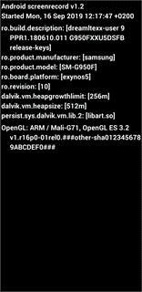

# Geofencer 
[](https://app.bitrise.io/app/62c5e7d6d14d57dd) [](https://jitpack.io/#kibotu/Geolocator)
[](https://jitpack.io/#exozet/Geolocator) [](https://hitsofcode.com/view/github/exozet/Geolocator)
[](https://android-arsenal.com/api?level=15) [](https://docs.gradle.org/current/release-notes) [](https://kotlinlang.org/) [](https://android-arsenal.com/details/1/7860)

Convenience library to receive user location updates and geofence events with minimal effort.

### Features

- supports Android 14
- receive updates on background
- receive updates if app got killed
- geofence updates (dwell, enter, exit)
- location updates
- configurable update intervals


     
### Requirements

1. Location permissions in [*AndroidManifest.xml*](app/src/main/AndroidManifest.xml#L5-L9)

	    <uses-permission android:name="android.permission.ACCESS_FINE_LOCATION" />
   	 	<uses-permission android:name="android.permission.ACCESS_COARSE_LOCATION" />
   	 	<uses-permission android:name="android.permission.ACCESS_BACKGROUND_LOCATION" />
   	 	
2. Google maps api key

		<string name="google_maps_key" templateMergeStrategy="preserve" translatable="false">YOUR_KEY</string>
	
### How to use

### Geofence

1. Create [Receiver](app/src/main/kotlin/com/sprotte/geolocator/demo/kotlin/NotificationWorker.kt)

```kotlin
class NotificationWorker : GeoFenceUpdateModule() {
	
    override fun onGeofence(geofence: Geofence) {
    	Timber.v(, "onGeofence $geofence")
    }
}
```

2. [Start geofence tracking](app/src/main/java/com/sprotte/geolocator/demo/kotlin/MainActivity.kt#L30-L39)

```kotlin
val geofence = Geofence(
    id = UUID.randomUUID().toString(),
    latitude = 51.0899232,
    longitude = 5.968358,
    radius = 30.0,
    title = "Germany",
    message = "Entered Germany",
    transitionType = GEOFENCE_TRANSITION_ENTER
)
    
Geofencer(this).addGeofenceWorker(geofence, NotificationWorker::class.java) { /* successfully added geofence */ }
```
### Location Tracker
TODO: replace with worker
1. Create [Receiver](app/src/main/java/com/sprotte/geolocator/demo/kotlin/LocationTrackerWorker.kt)

```kotlin
class LocationTrackerWorker : LocationTrackerUpdateModule() {

	override fun onLocationResult(locationResult: LocationResult) {  
		Log.v(GeoFenceIntentService::class.java.simpleName, "onLocationResult $location")
  }
}
```

2. [Start tracking](app/src/main/java/com/sprotte/geolocator/demo/kotlin/MainActivity.kt#L44-L45)

```kotlin
LocationTracker.requestLocationUpdates(this, LocationTrackerWorker::class.java)
```

4. Stop tracking

```kotlin
LocationTracker.removeLocationUpdates(requireContext())
```

### How to use in Java

### Geofence

1. Create [Receiver](app/src/main/java/com/sprotte/geolocator/demo/java/NotificationWorker.java)

```java
public class NotificationWorker extends GeoFenceUpdateModule {
	
	@Override
	public void onGeofence(@NotNull Geofence geofence) {
    	Timber.d("onGeofence " + geofence);
   	}
}
```

2. [Start geofence tracking](app/src/main/java/com/sprotte/geolocator/demo/java/AddGeoFenceActivity.java#L47-L56)

```java
Geofence geofence = new Geofence(
        UUID.randomUUID().toString(),
        51.0899232,
        5.968358,
        30.0,
        "Germany",
        "Entered Germany",
        GEOFENCE_TRANSITION_ENTER);
Geofencer geofencer = new Geofencer(this);
geofencer.addGeofenceWorker(geofence, NotificationWorker.class,
   	 () -> /* successfully added geofence */ Unit.INSTANCE);        	 
```
### Location Tracker

1. Create [Receiver](app/src/main/java/com/sprotte/geolocator/demo/java/LocationTrackerWorker.java)

```java
public class LocationTrackerWorker extends LocationTrackerUpdateModule {

    @Override
    public void onLocationResult(@NotNull LocationResult location) {
	
        Log.v(GeoFenceIntentService.class.getSimpleName(), "onLocationResult " + location);		        );
    }
}
```

2. [Start tracking](https://github.com/exozet/Geolocator/blob/master/app/src/main/java/com/sprotte/geolocator/demo/java/AddGeoFenceActivity.java#L65-L68)

```java
LocationTracker.INSTANCE.requestLocationUpdates(this, LocationTrackerWorker.class);
```

4. Stop tracking

```java
LocationTracker.INSTANCE.removeLocationUpdates(this);
```

### How to install

#### jCenter / mavenCentral

	implementation 'com.sprotte:Geolocator:latest'

#### or Jiptack

##### Step 1. Add the JitPack repository to your build file

Add it in your root build.gradle at the end of repositories:

	allprojects {
		repositories {
			maven { url 'https://jitpack.io' }
		}
	}
##### Step 2. Add the dependency

	dependencies {
		implementation 'com.github.exozet:Geolocator:latest'
		implementation 'com.google.android.gms:play-services-location:17.0.0'
	}

### Configuration

Default Location tracking update intervals can be overriden, by adding following parameter into your _app/res/_ - folder, e.g. [**app/res/config.xml**](app/src/main/res/values/config.xml#L4-L7)

``` xml
    <!-- Location Tracker -->
    <integer name="location_update_interval_in_millis">0</integer>
    <integer name="location_fastest_update_interval_in_millis">0</integer>
    <integer name="location_max_wait_time_interval_in_millis">0</integer>
    <integer name="location_min_distance_for_updates_in_meters">0</integer>

    <!-- Geofencer -->
    <integer name="loitering_delay">1</integer>
    <integer name="notification_responsiveness">1</integer>
    <integer name="expiration_duration">-1</integer> // -1 == NEVER_EXPIRE
```

You can also set this values at runtime in some step before call method `requestLocationUpdates`

``` java
    int interval = 1000;
    int fastestInterval = 2000;
    int priority = LocationRequest.PRIORITY_HIGH_ACCURACY;
    int maxWaitTime = 10000;
    int smallestDisplacement = 20;

    LocationTrackerParams locationTrackerParams = new LocationTrackerParams(
            interval, fastestInterval, priority, maxWaitTime, smallestDisplacement);

    LocationTracker.INSTANCE.requestLocationUpdates(this, LocationTrackerService.class, locationTrackerParams);
```
> LocationTrackerParams is a open class for kotlin or a not final class for java, so if you don't need to setup all params you can extend it.

### Known Issues

- does not work when in doze mode [#2](https://github.com/exozet/Geolocator/issues/2)


### Contributors

[Jan Rabe](jan.rabe@exozet.com)

[Paul Sprotte](paul.sprotte@exozet.com)

[AgnaldoNP] (https://github.com/AgnaldoNP)

[Mohammed Khalid Hamid](https://github.com/khalid64927)